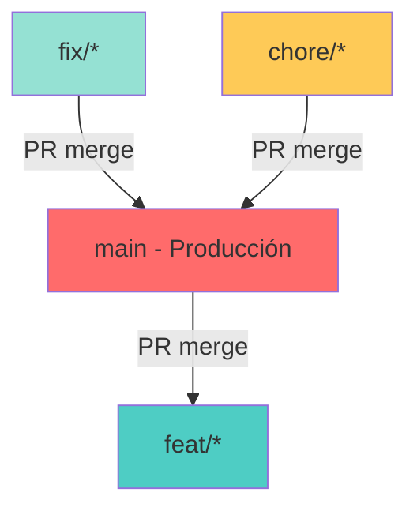
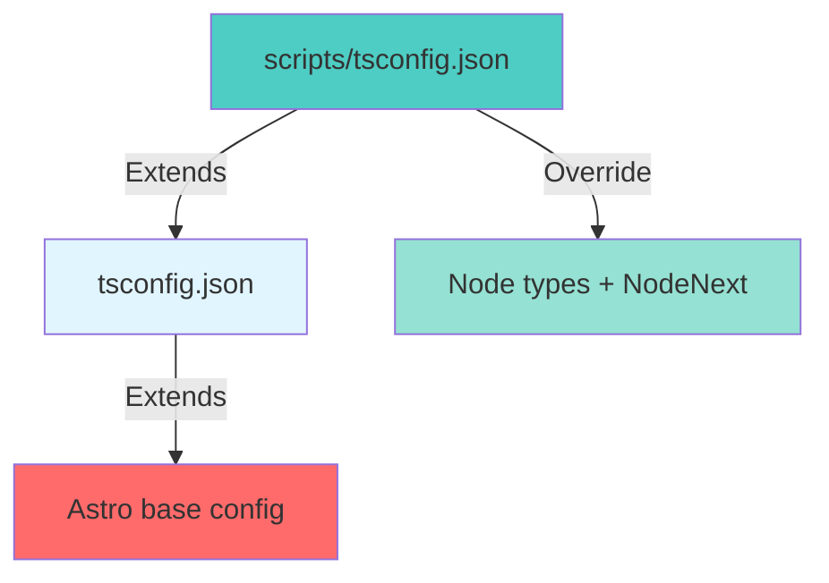

# Vektra Development Workflow

**← [Back to Documentation](./README.md)**

## Principios Fundamentales

### Regla de Oro
**No commits directos a la rama `main`.** Todos los cambios deben pasar por ramas de feature y ser mergeados vía Pull Request.

### Tipo de Proyecto
- **Dashboard estático**: Astro + React + Chart.js
- **Datos**: Ingestión desde GitHub GraphQL API
- **Modo actual**: Local PoC (no deployment automático)
- **Package manager**: pnpm

## Workflow Git

### Estrategia de Branching



| Rama | Propósito | Protección |
|------|-----------|------------|
| `main` | Código de producción, siempre estable | Protegida, sin commits directos |
| `feat/*` | Desarrollo de nuevas features | Merge a main vía PR |
| `fix/*` | Bug fixes | Merge a main vía PR |
| `chore/*` | Tareas de mantenimiento | Merge a main vía PR |

### Protocolo de Desarrollo

#### Fase 1: Inicio de Feature

1. **Actualizar main**
   ```bash
   git checkout main
   git pull origin main
   ```

2. **Crear rama de feature**
   ```bash
   git checkout -b feat/nombre-feature
   ```

3. **Validar tipado estricto**
   - TypeScript debe compilar sin errores
   - Scripts de ingestión deben tener tipos correctos

#### Fase 2: Desarrollo

**Principios de Código:**
- **Single Responsibility**: Cada componente tiene una responsabilidad clara
- **Organización por concern**: Agrupar componentes lógicamente (app-table/, charts/)
- **Tipado estricto**: No usar `any` a menos que sea absolutamente necesario
- **DRY**: No repetir código, extraer a utils cuando sea apropiado

**Component Structure:**
```
src/components/
├── app-table/          # Componentes de tabla
│   ├── AppTableClient.tsx      # Orquestador principal
│   ├── AppTableFilters.tsx     # Controles de búsqueda/filtro
│   ├── AppTableHeader.tsx      # Header ordenable
│   └── AppTableRow.tsx         # Fila individual
├── charts/             # Componentes de gráficos
│   ├── ActivityMatrixClient.tsx
│   ├── MaturityChartClient.tsx
│   └── TechStackBreakdownClient.tsx
├── RepoModal.tsx        # Modal compartido
└── utils.ts             # Utilidades compartidas
```

#### Fase 3: Commits

**Formato de Commit Messages:**
```
type(scope): description

[optional body]
```

Types:
- `feat`: Nueva feature
- `fix`: Bug fix
- `chore`: Mantenimiento
- `docs`: Documentación
- `refactor`: Refactoring
- `style`: Estilo/formatting
- `test`: Tests

**Reglas:**
- Commits agrupados por concern
- Todos los commits deben ser firmados con GPG
- Mensajes descriptivos, no genéricos

#### Fase 4: Pull Request

1. **Push feature branch**
   ```bash
   git push origin feat/nombre-feature
   ```

2. **Crear PR en GitHub**
   - Título descriptivo
   - Incluir número de issue relacionado (si aplica)
   - Descripción de cambios
   - Screenshots si es UI

3. **Request review**
   - Esperar aprobación
   - Address feedback

#### Fase 5: Merge

1. **Squash merge** (opcional pero recomendado)
   - Mantiene history limpia
   - Un commit por feature

2. **Delete feature branch**
   ```bash
   git branch -d feat/nombre-feature
   git push origin --delete feat/nombre-feature
   ```

## Protocolo de Release

### Pre-Release Checklist

- [ ] Todos los tests pasan
- [ ] TypeScript sin errores
- [ ] Build exitoso (`pnpm run build`)
- [ ] Documentación actualizada
- [ ] CHANGELOG.md actualizado
- [ ] No commits pendientes en main

### Proceso de Release

#### Paso 1: Merge a Main

```bash
git checkout main
git pull origin main
# Merge feature branch (via PR o directo si aprobado)
```

#### Paso 2: Bump de Versión

**Actualizar package.json:**
```json
{
  "version": "1.0.0"  // bump to next version
}
```

**SemVer:**
- **MAJOR**: Cambios breaking incompatibles
- **MINOR**: Nuevas features backward-compatible
- **PATCH**: Bug fixes backward-compatible

#### Paso 3: CHANGELOG.md

```markdown
## [1.0.0] - 2026-10-05

### Added
- Feature 1
- Feature 2

### Changed
- Changed something

### Fixed
- Fixed bug 1
```

#### Paso 4: Commit de Release

```bash
git add package.json CHANGELOG.md
git commit -m "chore: bump version to 1.0.0"
```

#### Paso 5: Crear Tag Firmado

```bash
git tag -a v1.0.0 -m "Release v1.0.0"
```

**Importante:** Tag debe crearse DESPUÉS del merge, no antes.

#### Paso 6: Push Tag

```bash
git push origin main
git push origin v1.0.0
```

#### Paso 7: GitHub Release

1. GitHub → Releases → Create new release
2. Seleccionar tag `v1.0.0`
3. Copiar contenido de CHANGELOG.md
4. Publicar release

### Clasificación de Versiones

Basado en Semantic Versioning y niveles de madurez:

| Nivel | Rango de Versión | Descripción |
|-------|------------------|-------------|
| PoC | < 1.0.0 (0.x.x) | Proof of Concept, experimental |
| MVP | 1.0.0 - 1.99.99 (1.x.x) | Minimum Viable Product, estable pero evolucionando |
| Production | ≥ 2.0.0 (2.x.x+) | Production-ready, maduro, API estable |

## Configuración TypeScript

### Estructura de Configuración



### tsconfig.json (Main Project)

```json
{
  "extends": "astro/tsconfigs/strict",
  "include": ["src/**/*"],
  "exclude": ["node_modules", "dist", ".astro", "**/*.astro", "scripts"],
  "compilerOptions": {
    "types": ["astro/client", "node"],
    "typeRoots": ["./node_modules/@types", "./.astro"],
    "jsx": "react-jsx",
    "jsxImportSource": "react"
  }
}
```

### scripts/tsconfig.json (Node Scripts)

```json
{
  "extends": "../tsconfig.json",
  "compilerOptions": {
    "types": ["node"],
    "module": "NodeNext",
    "moduleResolution": "NodeNext",
    "lib": ["ES2020"],
    "target": "ES2020"
  },
  "include": ["*.ts"]
}
```

### Reglas de Imports

**Main project (src/):**
- React: Sin import de React (JSX moderno)
- Relative imports: Sin extensión `.js` (resolución automática)

**Scripts (scripts/):**
- Node: Con extensión `.js` requerida (ES modules)
- Example: `import type { Repository } from './types.js'`

## Protocolo de Data Ingestion

### Local Development

```bash
# 1. Autenticar gh-cli
gh auth login

# 2. Ingestar datos
pnpm run ingest
```

**El script:**
- Fetch repos activos de organización
- Mide madurez basado en Common Software Engineering Practices
- Genera `src/data/portfolio-telemetry.json` (gitignored)

### Refresh Manual

Para actualizar datos:
1. Run `pnpm run ingest`
2. Cambios escritos a JSON local
3. Restart dev server

## Troubleshooting

### TypeScript Errors - React/Chart.js

**Síntoma:** Cannot find module 'react' o 'react-chartjs-2'

**Diagnóstico:**
```bash
# Verificar configuración
cat tsconfig.json
```

**Solución:**
- Asegurar que `tsconfig.json` extiende `astro/tsconfigs/strict`
- Asegurar que `scripts/tsconfig.json` existe con Node types
- Restart TypeScript server en IDE

### Module Resolution Issues

**Síntoma:** Cannot find module

**Diagnóstico:**
```bash
# Verificar package manager
cat package.json
```

**Solución:**
- Usar pnpm (no npm/yarn)
- Asegurar que `pnpm-workspace.yaml` existe
- Reinstalar: `rm -rf node_modules && pnpm install`

### Chart.js Type Errors

**Síntoma:** Type incompatibility en chart options

**Solución:**
```typescript
// Usar as const para string literals
font: {
  size: 18,
  weight: 'bold' as const,  // <- as const
}
```

## Protocolo de Deployment

### Estado Actual

- **Modo**: Local-only PoC
- **Datos**: JSON local (gitignored)
- **Deployment**: GitHub Pages deshabilitado
- **GitHub Actions**: Workflow de refresh deshabilitado

### Deployment Futuro (Opcional)

#### Paso 1: Habilitar GitHub Actions

Descomentar `.github/workflows/refresh-telemetry.yml`

#### Paso 2: Configurar GitHub Pages

- Settings → Pages
- Branch: `main`
- Folder: `/dist`

#### Paso 3: Configurar Secrets

- `GITHUB_TOKEN` (automático)
- Configurar organización en workflow

## Protocolo de Agregar Nuevas Dimensiones

Cuando agregar nuevas dimensiones de madurez:

1. **Documentar lógica de negocio** en `docs/README.md`
2. **Crear documento de dimensión** en `docs/dimension-X-name.md`
3. **Actualizar tipos** en `scripts/types.ts`
4. **Actualizar lógica de scoring** en `scripts/scoring.ts`
5. **Actualizar script de ingestión** en `scripts/index.ts`
6. **Agregar componentes UI** para mostrar nuevas métricas
7. **Test con refresh de datos local`

## Reglas de Seguridad

- **Nunca commitear secrets**: API keys, tokens, datos sensibles
- **Usar environment variables**: Para secrets en producción
- **GPG signing**: Todos los commits deben ser firmados
- **Branch protection**: Rama main debe estar protegida
- **Secretos en GitHub**: Usar GitHub Secrets para CI/CD

## Checklists

### Pre-Commit

- [ ] TypeScript compila sin errores
- [ ] Linting pasa
- [ ] Build exitoso
- [ ] Commits firmados con GPG
- [ ] Mensajes de commit follow conventional commits

### Pre-Merge

- [ ] PR reviewed and approved
- [ ] CI/CD checks pasan (si están habilitados)
- [ ] No conflicts con main
- [ ] Documentation actualizada

### Pre-Release

- [ ] Feature branches merged to main
- [ ] Version bumped en package.json
- [ ] CHANGELOG.md actualizado
- [ ] Tag creado firmado
- [ ] GitHub release creado
