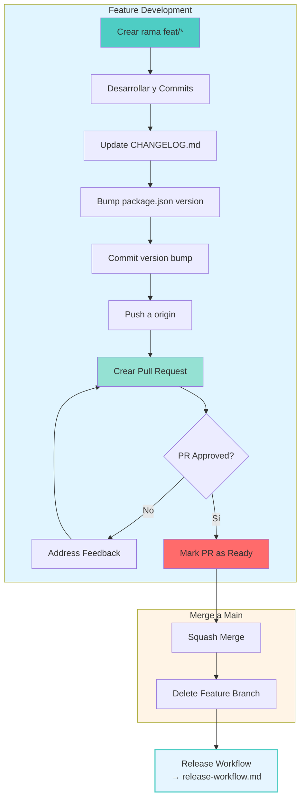
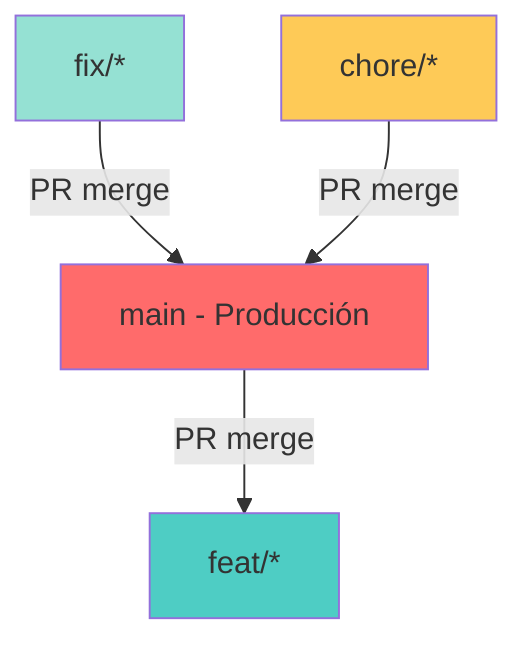
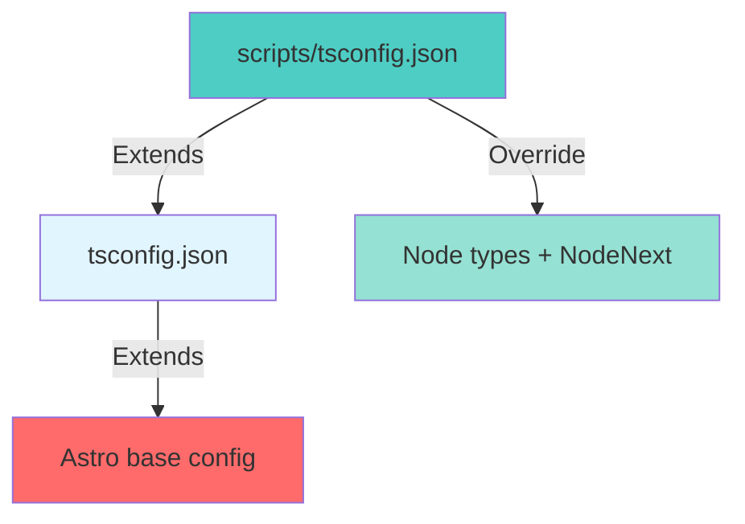

# Development Workflow

**← [Back to Manuals](./README.md)**

## Principio Fundamental

**No commits directos a la rama `main`.** Todos los cambios deben pasar por ramas de feature y ser mergeados vía Pull Request.

**Importante:** Los cambios de release (CHANGELOG.md y version bump) también deben hacerse en la rama de feature ANTES del merge, ya que main tiene protección que prohíbe commits directos.

## Flujo de Desarrollo



**Continuación del workflow:** Después del merge, ver [Release Workflow](./release-workflow.md) para el proceso de creación de tags y GitHub release.

### Paso a Paso

**1. Feature Development**
```bash
git checkout main
git pull origin main
git checkout -b feat/nombre-feature
# Desarrollar y hacer commits
```

**2. Pre-Merge Prep (en feature branch)**
```bash
# Actualizar CHANGELOG.md
# Bump package.json version
git add CHANGELOG.md package.json
git commit -m "chore: bump version to 1.0.0"
git push origin feat/nombre-feature
```

**3. Pull Request**
- Crear PR en GitHub
- Request review
- Wait for approval
- Mark PR as ready

**4. Merge**
- Squash merge (recomendado)
- Delete feature branch

**5. Release**
- Continuar en [Release Workflow](./release-workflow.md)

## Estrategia de Branching



| Rama | Propósito | Protección |
|------|-----------|------------|
| `main` | Código de producción, siempre estable | Protegida, sin commits directos |
| `feat/*` | Desarrollo de nuevas features | Merge a main vía PR |
| `fix/*` | Bug fixes | Merge a main vía PR |
| `chore/*` | Tareas de mantenimiento | Merge a main vía PR |

## Protocolo de Feature Development

### Fase 1: Inicio

```bash
git checkout main
git pull origin main
git checkout -b feat/nombre-feature
```

### Fase 2: Desarrollo

**Principios:**
- **Single Responsibility**: Cada componente tiene una responsabilidad clara
- **Organización por concern**: Agrupar componentes lógicamente
- **Tipado estricto**: No usar `any` a menos que sea necesario
- **DRY**: Extraer a utils cuando sea apropiado

**Component Structure:**
```
src/components/
├── app-table/          # Table components
│   ├── AppTableClient.tsx
│   ├── AppTableFilters.tsx
│   ├── AppTableHeader.tsx
│   └── AppTableRow.tsx
├── charts/             # Chart components
│   ├── ActivityMatrixClient.tsx
│   ├── MaturityChartClient.tsx
│   └── TechStackBreakdownClient.tsx
├── RepoModal.tsx        # Shared modal
└── utils.ts             # Shared utilities
```

### Fase 3: Commits

**Formato:**
```
type(scope): description
```

**Types:**
- `feat`: Nueva feature
- `fix`: Bug fix
- `chore`: Mantenimiento
- `docs`: Documentación
- `refactor`: Refactoring
- `style`: Estilo/formatting

**Reglas:**
- Commits agrupados por concern
- Todos los commits deben ser firmados con GPG
- Mensajes descriptivos

### Fase 4: Pre-Merge Release Prep

**En la rama de feature, antes de crear el PR:**

```bash
# Actualizar CHANGELOG.md
nano CHANGELOG.md
```

**Formato de CHANGELOG.md:**
```markdown
## [1.0.0] - 2026-10-05

### Added
- Feature 1
- Feature 2

### Changed
- Updated something

### Fixed
- Fixed bug 1
```

**Bump version en package.json:**
```json
{
  "version": "1.0.0"
}
```

**Commit de version bump:**
```bash
git add CHANGELOG.md package.json
git commit -m "chore: bump version to 1.0.0"
git push origin feat/nombre-feature
```

**Decisión de versión (SemVer):**
- **MAJOR**: Cambios breaking incompatibles
- **MINOR**: Nuevas features backward-compatible
- **PATCH**: Bug fixes backward-compatible

### Fase 5: Pull Request

```bash
git push origin feat/nombre-feature
```

- Crear PR en GitHub
- Título descriptivo
- Incluir número de issue si aplica
- Request review

### Fase 6: Merge

1. **Squash merge** (recomendado) - history limpia
2. **Delete feature branch**
   ```bash
   git branch -d feat/nombre-feature
   git push origin --delete feat/nombre-feature
   ```

**Después del merge:** Continuar en [Release Workflow](./release-workflow.md) para crear el tag y GitHub release.

## Configuración TypeScript

### Estructura



### Reglas de Imports

**Main project (src/):**
- React: Sin import de React (JSX moderno)
- Relative imports: Sin extensión `.js`

**Scripts (scripts/):**
- Node: Con extensión `.js` requerida (ES modules)
- Example: `import type { Repository } from './types.js'`

## Data Ingestion

```bash
gh auth login
pnpm run ingest
```

## Troubleshooting

### TypeScript Errors

**Síntoma:** Cannot find module 'react' o 'react-chartjs-2'

**Solución:**
- Asegurar que `tsconfig.json` extiende `astro/tsconfigs/strict`
- Asegurar que `scripts/tsconfig.json` existe con Node types
- Restart TypeScript server en IDE

### Module Resolution

**Síntoma:** Cannot find module

**Solución:**
- Usar pnpm (no npm/yarn)
- Asegurar que `pnpm-workspace.yaml` existe
- Reinstalar: `rm -rf node_modules && pnpm install`

### Chart.js Types

**Síntoma:** Type incompatibility

**Solución:**
```typescript
weight: 'bold' as const
```

## Referencias

- **[Release Workflow](./release-workflow.md)**: Protocolo de release completo
- **[Dimension 1](../dimension-1-common-practices.md)**: Métricas y scoring
