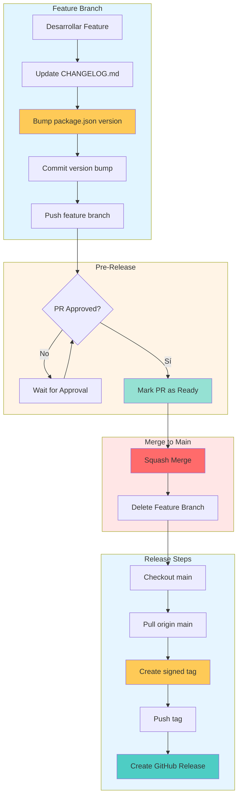

# Release Workflow

**← [Back to Manuals](./README.md)**

## Propósito

Protocolo estandarizado para crear releases en Vektra, asegurando versionamiento semántico, documentación completa, y tags firmados.

**Regla Clave:** Como `main` tiene protección que prohíbe commits directos, todos los cambios de release (CHANGELOG.md y version bump) deben hacerse en la rama de feature ANTES del merge.

## Flujo Completo de Release



## Proceso de Release

### Paso 1: Preparar Feature Branch (antes de PR)

**En la rama de feature:**

```bash
# Actualizar CHANGELOG.md
nano CHANGELOG.md
```

**Formato:**
```markdown
## [1.0.0] - 2026-10-05

### Added
- Feature 1
- Feature 2

### Changed
- Updated something

### Fixed
- Fixed bug 1
```

**Reglas:**
- Documentar todos los cambios significativos
- Agrupar por categoría (Added, Changed, Fixed, Removed)
- Incluir fecha de release
- Referenciar issues o PRs si aplica

### Paso 2: Bump de Versión (en feature branch)

**Actualizar package.json:**

```json
{
  "version": "1.0.0"  // bump to next version
}
```

**Decisión de Versión (SemVer):**

|| Tipo | Cuándo usar | Ejemplo |
||------|-------------|---------|
|| **MAJOR** | Cambios breaking incompatibles, cambios mayores en API | 1.0.0 → 2.0.0 |
|| **MINOR** | Nuevas features backward-compatible | 1.0.0 → 1.1.0 |
|| **PATCH** | Bug fixes backward-compatible | 1.0.0 → 1.0.1 |

**Clasificación de Madurez:**

|| Nivel | Rango de Versión | Descripción |
||-------|------------------|-------------|
|| PoC | < 1.0.0 (0.x.x) | Proof of Concept, experimental |
|| MVP | 1.0.0 - 1.99.99 (1.x.x) | Minimum Viable Product, estable pero evolucionando |
|| Production | ≥ 2.0.0 (2.x.x+) | Production-ready, maduro, API estable |

### Paso 3: Commit de Version Bump (en feature branch)

```bash
git add CHANGELOG.md package.json
git commit -m "chore: bump version to 1.0.0"
git push origin feat/nombre-feature
```

**Regla:** Este commit debe ser único y limpio, solo para version bump.

### Paso 4: Validar PR Approval

```bash
# Verificar estado del PR en GitHub
gh pr view <PR_NUMBER>
```

**Requisitos:**
- PR debe estar approved
- CI/CD checks deben pasar (si están habilitados)
- No conflicts con main

### Paso 5: Marcar PR como Ready

En GitHub:
- Ir al PR
- Click "Mark as ready for review" (si está en draft)
- Asegurar que esté en estado "Ready to merge"

### Paso 6: Squash Merge

En GitHub:
- Click "Merge pull request"
- Select "Squash and merge"
- Confirm merge

**Resultado:** Feature branch merged a main con un solo commit

### Paso 7: Checkout Main y Pull

```bash
git checkout main
git pull origin main
```

### Paso 8: Crear Tag Firmado

```bash
git tag -a v1.0.0 -m "Release v1.0.0"
```

**Regla:** Tag debe crearse DESPUÉS del merge a main, nunca antes.

**Verificar tag:**
```bash
git tag -l -n1
git show v1.0.0
```

### Paso 9: Push Tag

```bash
git push origin v1.0.0
```

### Paso 10: GitHub Release

1. **Ir a GitHub**
   - Repository → Releases → "Create a new release"

2. **Configurar Release**
   - Choose tag: `v1.0.0`
   - Release title: `v1.0.0`
   - Description: Copiar contenido de CHANGELOG.md

3. **Publicar**
   - Click "Publish release"

### Paso 11: Post-Release

```bash
# Verificar release
gh release view v1.0.0

# Verificar tags
git tag -l
```

## Rollback (si es necesario)

Si hay un problema crítico con el release:

### Opción 1: Crear Hotfix

```bash
git checkout -b fix/hotfix-issue
# Hacer fix
git commit -m "fix: critical bug"
git push origin fix/hotfix-issue
# Merge a main
# Bump PATCH version
# Crear tag v1.0.1
```

### Opción 2: Delete Tag y Release

```bash
# Local
git tag -d v1.0.0
git push origin :refs/tags/v1.0.0

# GitHub
# Delete release en GitHub UI
```

## Versioning Strategy

### Primera Release (1.0.0)

**Criterios:**
- Todas las features core implementadas
- Dashboard funcional con datos reales
- Documentation completa
- Build y deployment funcionan

### Releases Subsecuentes

**Incremento PATCH (1.0.0 → 1.0.1):**
- Bug fixes
- Pequeñas mejoras
- Documentación updates

**Incremento MINOR (1.0.0 → 1.1.0):**
- Nuevas features
- Nuevas dimensiones de métricas
- Mejoras significativas en UI

**Incremento MAJOR (1.0.0 → 2.0.0):**
- Cambios breaking
- Rediseño mayor de arquitectura
- Cambios en data model

## Branch Protection

### Configuración Recomendada

En GitHub → Settings → Branches:

**Rama main:**
- [x] Require a pull request before merging
- [x] Require approvals (1 approval)
- [x] Require status checks to pass before merging
- [x] Require branches to be up to date before merging
- [x] Do not allow bypassing the above settings

## Checklist de Release (10 Pasos)

- [ ] **1.** UPDATE CHANGELOG.md - En feature branch, documentar cambios
- [ ] **2.** BUMP SemVer - En feature branch, actualizar package.json
- [ ] **3.** COMMIT VERSION BUMP - En feature branch, commit de changelog y version
- [ ] **4.** PUSH FEATURE - Push feature branch con cambios de release
- [ ] **5.** VALIDATE APPROVAL - Verificar que PR está approved
- [ ] **6.** MARK READY - Cambiar estado de PR a ready
- [ ] **7.** SQUASH MERGE - Merge squash a main desde GitHub
- [ ] **8.** CHECKOUT MAIN - `git checkout main` y `git pull origin main`
- [ ] **9.** CREATE SIGNED TAG - `git tag -a v1.0.0 -m "Release v1.0.0"`
- [ ] **10.** PUBLISH RELEASE - Crear y publicar GitHub release desde el tag
