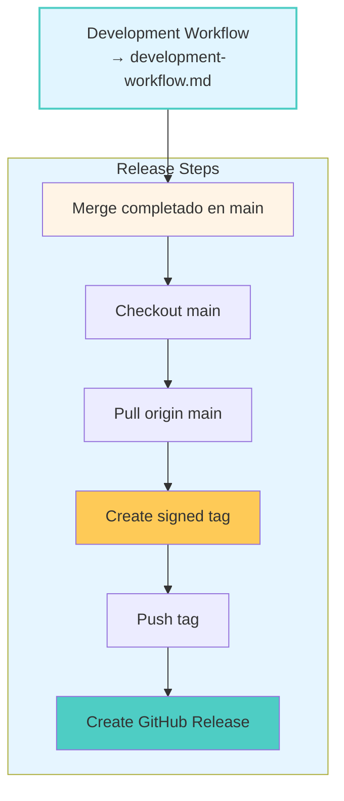

# Release Workflow

**← [Back to Manuals](./README.md)**

## Propósito

Protocolo estandarizado para crear releases en Vektra, asegurando versionamiento semántico, documentación completa, y tags firmados.

**Regla Clave:** Como `main` tiene protección que prohíbe commits directos, todos los cambios de release (CHANGELOG.md y version bump) deben hacerse en la rama de feature ANTES del merge.

## Flujo de Release

**Antes del release:** Ver [Development Workflow](./development-workflow.md) para el proceso de desarrollo y merge a main.



## Proceso de Release

**Prerrequisito:** El feature branch debe haber sido mergeado a main siguiendo el [Development Workflow](./development-workflow.md).

### Pasos Pre-Release (en Feature Branch)

Estos pasos ya deben haberse completado en la rama de feature antes del merge:

1. **Update CHANGELOG.md** - Documentar todos los cambios
2. **Bump package.json version** - Actualizar a nueva versión (SemVer)
3. **Commit version bump** - `git add CHANGELOG.md package.json && git commit -m "chore: bump version to 1.0.0"`
4. **Push feature branch** - `git push origin feat/nombre-feature`
5. **Create PR** - Crear Pull Request en GitHub
6. **Validate approval** - Esperar aprobación del PR
7. **Mark as ready** - Marcar PR como ready for merge
8. **Squash merge** - Merge squash a main desde GitHub

Ver [Development Workflow](./development-workflow.md) para detalles completos de estos pasos.

### Paso 1: Checkout Main y Pull

```bash
git checkout main
git pull origin main
```

### Paso 2: Crear Tag Firmado

```bash
git tag -a v1.0.0 -m "Release v1.0.0"
```

**Regla:** Tag debe crearse DESPUÉS del merge a main, nunca antes.

**Verificar tag:**
```bash
git tag -l -n1
git show v1.0.0
```

### Paso 3: Push Tag

```bash
git push origin v1.0.0
```

### Paso 4: GitHub Release

1. **Ir a GitHub**
   - Repository → Releases → "Create a new release"

2. **Configurar Release**
   - Choose tag: `v1.0.0`
   - Release title: `v1.0.0`
   - Description: Copiar contenido de CHANGELOG.md

3. **Publicar**
   - Click "Publish release"

### Paso 5: Post-Release

```bash
git tag -a v1.0.0 -m "Release v1.0.0"
```

**Regla:** Tag debe crearse DESPUÉS del merge a main, nunca antes.

**Verificar tag:**
```bash
git tag -l -n1
git show v1.0.0
```

### Paso 9: Push Tag

```bash
git push origin v1.0.0
```

### Paso 10: GitHub Release

1. **Ir a GitHub**
   - Repository → Releases → "Create a new release"

2. **Configurar Release**
   - Choose tag: `v1.0.0`
   - Release title: `v1.0.0`
   - Description: Copiar contenido de CHANGELOG.md

3. **Publicar**
   - Click "Publish release"

### Paso 11: Post-Release

```bash
# Verificar release
gh release view v1.0.0

# Verificar tags
git tag -l
```

## Rollback (si es necesario)

Si hay un problema crítico con el release:

### Opción 1: Crear Hotfix

```bash
git checkout -b fix/hotfix-issue
# Hacer fix
git commit -m "fix: critical bug"
git push origin fix/hotfix-issue
# Merge a main
# Bump PATCH version
# Crear tag v1.0.1
```

### Opción 2: Delete Tag y Release

```bash
# Local
git tag -d v1.0.0
git push origin :refs/tags/v1.0.0

# GitHub
# Delete release en GitHub UI
```

## Versioning Strategy

### SemVer Guidelines

Ver [Development Workflow](./development-workflow.md) para detalles completos sobre cómo decidir el tipo de version bump.

**Resumen:**
- **MAJOR**: Cambios breaking incompatibles (1.0.0 → 2.0.0)
- **MINOR**: Nuevas features backward-compatible (1.0.0 → 1.1.0)
- **PATCH**: Bug fixes backward-compatible (1.0.0 → 1.0.1)

### Clasificación de Madurez

|| Nivel | Rango de Versión | Descripción |
||-------|------------------|-------------|
|| PoC | < 1.0.0 (0.x.x) | Proof of Concept, experimental |
|| MVP | 1.0.0 - 1.99.99 (1.x.x) | Minimum Viable Product, estable pero evolucionando |
|| Production | ≥ 2.0.0 (2.x.x+) | Production-ready, maduro, API estable |

### Primera Release (1.0.0)

**Criterios:**
- Todas las features core implementadas
- Dashboard funcional con datos reales
- Documentation completa
- Build y deployment funcionan

## Branch Protection

### Configuración Recomendada

En GitHub → Settings → Branches:

**Rama main:**
- [x] Require a pull request before merging
- [x] Require approvals (1 approval)
- [x] Require status checks to pass before merging
- [x] Require branches to be up to date before merging
- [x] Do not allow bypassing the above settings

## Checklist de Release (5 Pasos)

**Prerrequisito:** Feature branch mergeado a main con CHANGELOG.md y version bump (ver [Development Workflow](./development-workflow.md))

- [ ] **1.** CHECKOUT MAIN - `git checkout main` y `git pull origin main`
- [ ] **2.** CREATE SIGNED TAG - `git tag -a v1.0.0 -m "Release v1.0.0"`
- [ ] **3.** PUSH TAG - `git push origin v1.0.0`
- [ ] **4.** CREATE GITHUB RELEASE - Ir a GitHub → Releases → Create new release
- [ ] **5.** PUBLISH RELEASE - Seleccionar tag, copiar CHANGELOG.md, publicar
